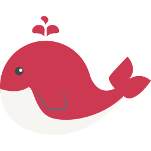

以下是您提供的内容的英文翻译：

---

<div align="center">
  
  <h1>NestAdmin</h1>
  <span>Chinese | <a href="./README.en_US.md">English</a></span>
</div>

---

[](./LICENSE)
[](https://github.com/mrzym99/nest-admin)
[](https://github.com/mrzym99/nest-admin)
[](https://github.com/mrzym99/nest-admin)

> [Gitee address](https://github.com/mrzym99/nest-admin): https://github.com/mrzym99/nest-admin

> [Github address](https://github.com/mrzym99/nest-admin): https://github.com/mrzym99/nest-admin

## Introduction

[NestAdmin](https://github.com/mrzym99/nest-admin) is a simple and efficient backend management system based on the latest front-end technology stack, including Nestjs, TypeScript, TypeOrm, Mysql, and Redis. It is suitable for WEB full-stack developers to quickly develop backend management systems. The accompanying front-end project for NestAdmin is Vue3NaiveAdmin, available at [Frontend Project Link](https://gitee.com/mrzym/vue3-naive-admin).

## Online Experience

[Online Demo](https://nest.mrzym.top)

## Basic Features

- [x] User registration and login
- [x] Role-based permission management
- [x] Department management
- [x] Role management
- [x] User management
- [x] Menu management
- [x] File upload
- [x] Email sending
- [x] Verification code
- [x] Log service
- [x] Scheduled tasks
- [x] Data dictionary

## API Documentation

- Swagger Documentation: [Swagger](https://nest-server.mrzym.top:3366/docs)
- Knife4j Version: [Swagger-Knife4j](https://nest-server.mrzym.top:3366/doc.html)

## Usage

### Environment Preparation

Ensure that your environment meets the following requirements:

- **git**: Required for cloning and managing project versions.
- **NodeJS**: >20, recommended version 21.7.3 or higher.
- **pnpm**: >9, recommended version 9.9.0 or higher.

### Clone the Project

```bash
git clone https://github.com/mrzym99/nest-admin.git
```

### Import SQL File

The SQL file is available at [nest_admin.sql](./sql/nest_admin.sql). You need to create a `nest_admin` database in your local MySQL and import the `nest_admin.sql` file.
Locally, you need to start MySQL and Redis.

### Environment Configuration

The configuration files contain comments, mainly for configuring MySQL and Redis:

- [.env](./env) for basic configuration
- [.env.development](./env.development) for development environment configuration
- [.env.production](./env.production) for production environment configuration

### Install Dependencies

```bash
pnpm i
```

> This project uses pnpm to manage dependencies. If you do not have pnpm installed, please install it first (`npm i pnpm -g`).

### Start the Project

```bash
pnpm run start:dev
```

After running, you can find the project's running address and Swagger documentation address in the project logs.

## Docker Build

This project uses Docker to build and run. Follow these steps to build and run the project:

### Environment Requirements

Your environment must meet the following requirements:

- Stable versions of Docker and Docker Compose are required.

### Notes

- `docker-compose.yml` corresponds to the development environment (`dev`), while `docker-compose.prod.yml` corresponds to the production environment (`prod`).

1. Build the project:

```bash
docker-compose build
```

2. Run the project:

```bash
docker-compose up -d // (-f [filename] can specify a different compose file; `-d` runs in the background, suitable for running on a server. Exiting the terminal will not stop the containers)
```

3. Stop and remove:

```bash
docker-compose down // (use `-v` to delete container data)
```

For a comprehensive list of Docker Compose commands, refer to [Docker Compose Command List](https://www.cnblogs.com/xyh9039/p/18540766).

If you encounter build failures, it may be due to issues with your Docker environment. You can try switching to a different Docker source, such as [Alibaba Cloud Mirror Acceleration](https://cr.console.aliyun.com/cn-hangzhou/instances/mirrors).

## Docker Common Commands

1. Build an image:

```bash
// Build an image with `image_name` as the image name and `tag` as the version
docker build -t <image_name>:<tag> .
e.g., docker build -t nest-admin:v1 .
```

2. View images:

```bash
docker images
```

3. Run a container:

```bash
docker run -d -p 3000:3000 --name my-app my-app:v1
// `-p 3000:3000` indicates port mapping. The first `3000` is the host (server) port, and the second `3000` is the container port.
```

4. View containers:

```bash
docker ps
```

## Docker Compose Common Commands

```
docker-compose build: Build images.
docker-compose up: Create and start containers.
docker-compose down: Stop and remove containers, networks, and volumes (if using the `-v` option).
docker-compose start: Start services.
docker-compose stop: Stop services.
docker-compose restart: Restart services.
docker-compose logs: View container logs.
docker-compose ps: List all containers.
docker-compose config: Check the configuration of the docker-compose.yml file.
```

## Communication

`NestAdmin` is a fully open-source and free project designed to help developers more conveniently build medium and large-scale management systems. We also provide WeChat and QQ groups for communication. Feel free to ask questions in the group.

<div>
  <p>QQ Group</p>
  
</div>

## Open Source License

This project is licensed under the [MIT © 2025 Xiao Zhang](./LICENSE) license for learning and reference purposes only. For commercial use, please retain the author's copyright information. The author does not guarantee or assume any risks associated with the use of this software.
